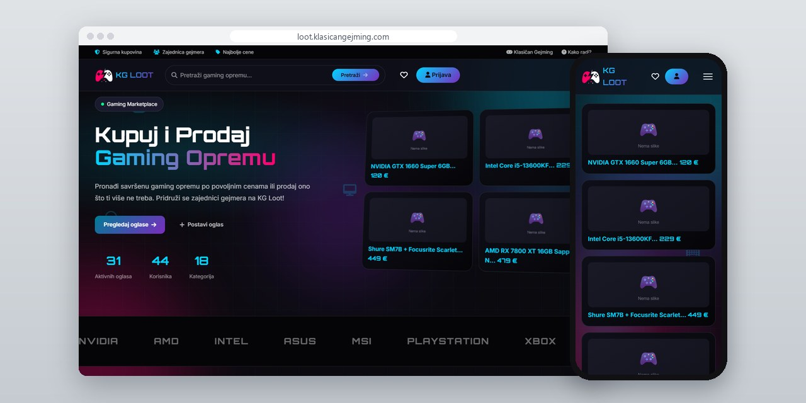
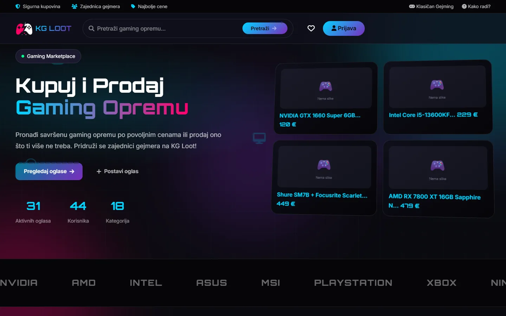
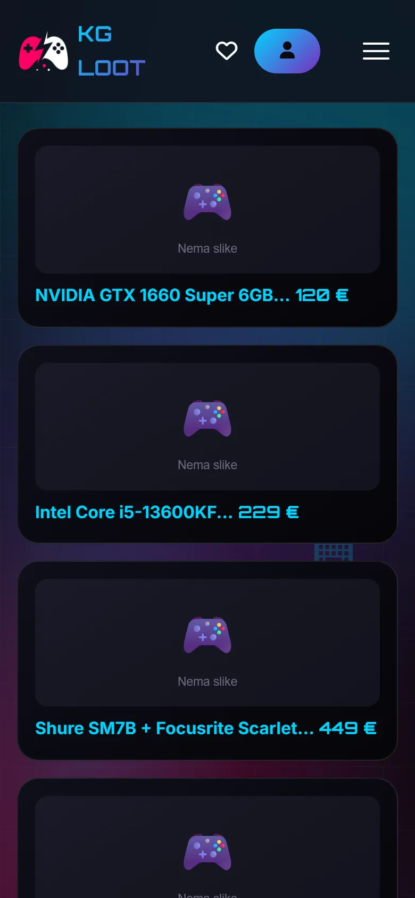
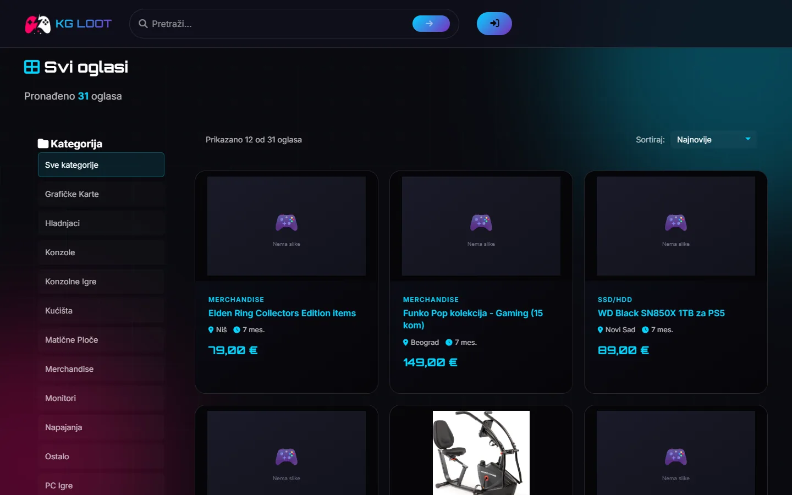
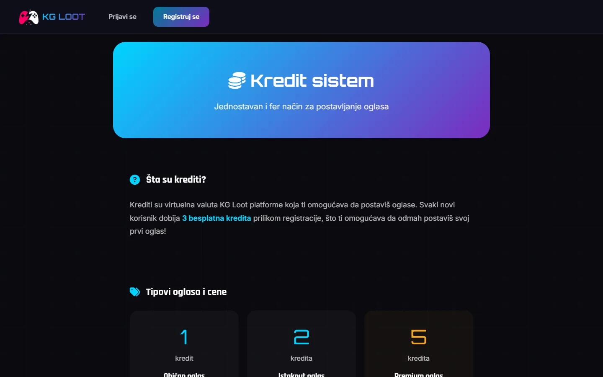

# KG Loot

Marketplace for used gaming gear, built alongside the Klasičan Gejming portal, with filtered search, messages between users and listing credits.

**[loot.klasicangejming.com](https://loot.klasicangejming.com/)** · [Srpski](README.sr.md)

> [!NOTE]
> Client project. The source code belongs to the client and stays in a private repository. This page describes what I built and how.

<table>
  <tr><td><b>Client</b></td><td>Klasičan Gejming</td></tr>
  <tr><td><b>Industry</b></td><td>Marketplace for used gaming gear</td></tr>
  <tr><td><b>Location</b></td><td>Serbia</td></tr>
  <tr><td><b>Type</b></td><td>Marketplace web app (PWA)</td></tr>
  <tr><td><b>My role</b></td><td>Design, development, SEO, hosting and maintenance</td></tr>
  <tr><td><b>Stack</b></td><td>PHP, MariaDB, PWA</td></tr>
</table>

## About the project

KG Loot is the marketplace side of the Klasičan Gejming community, where gamers sell graphics cards, consoles, games and peripherals they no longer use. I built it alongside the portal, with 18 categories that range from graphics cards and SSDs to retro gaming and streaming gear.

Each listing is a page with photos, condition, city, price and a view count, and buttons to call, message the seller on the site or open WhatsApp. Posting runs on credits, and every new account gets three free ones. A listing can be regular, featured at the top of its category, premium on the front page or marked as an urgent sale, and an expired one can be brought back from My listings.

## What I built

- Search by keyword, category, city, condition and price range, sorted by newest, oldest or price
- Listing pages with safety tips for buyers and similar listings from the same category
- Messages between buyers and sellers inside the platform, next to one-tap call and WhatsApp buttons
- Credits for listing types, with runs of 30 days, or 14 for an urgent sale, and three free credits on sign-up
- Usage rules covering the age limit, one account per person, banned items and sanctions
- Installable as a PWA, with forms protected by an invisible check the browser solves in the background and a one-click fallback

## Results

| | Performance | Accessibility | Best practices | SEO |
| :-- | :-: | :-: | :-: | :-: |
| Mobile | 100 | 100 | 100 | 100 |
| Desktop | 100 | 98 | 100 | 100 |

Lighthouse, lab test of the live site, September 2026.

## Screenshots

<table>
  <tr>
    <td width="68%" valign="top"></td>
    <td width="32%" valign="top"></td>
  </tr>
</table>

Listing search by category

How buying and selling works

---

Built by [D. Svilenković](https://svilenkovic.com).
